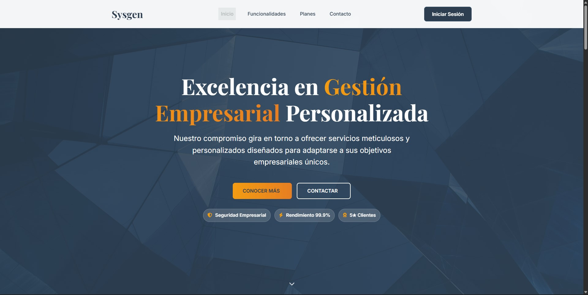

# Proyecto Final - Curso de Desarrollo Web (CoderHouse)  

  

## Descripción  
Este proyecto corresponde a la **Entrega Final** del curso de **Desarrollo Web** en [CoderHouse](https://www.coderhouse.com/).  
Se trata de una **página administrativa** que cumple con los lineamientos y criterios evaluativos establecidos, incluyendo estructura HTML, estilo CSS, uso de frameworks, técnicas de SEO, animaciones y diseño responsive.  

📂 **Repositorio en GitHub:** [Entrega3-RuizDiaz_Lucas](https://github.com/lucasDis/Entrega3-RuizDiaz_Lucas)  
🌐 **Versión en línea:** *[hosting InfinityFree](https://sysgenargentina.ct.ws/)*

## 🎯 Objetivos alcanzados  

- **Estructura completa del sitio web**  
- **Estilo final de la web** con Bootstrap + SASS  
- **SEO y accesibilidad** optimizados  
- **Animaciones y dinamismo** con transiciones y efectos hover  
- **Subida al servidor** y pruebas en hosting gratuito  

---

## 🛠 Tecnologías utilizadas  

- **HTML5** – estructura semántica  
- **CSS3 / SASS** – estilos personalizados  
- **Bootstrap 5** – sistema de grillas y componentes responsivos  
- **JavaScript** – interacción básica  

---

## 🚀 Instalación y ejecución local  

1. Clonar el repositorio:  
   ```bash
   git clone https://github.com/lucasDis/Entrega3-RuizDiaz_Lucas
